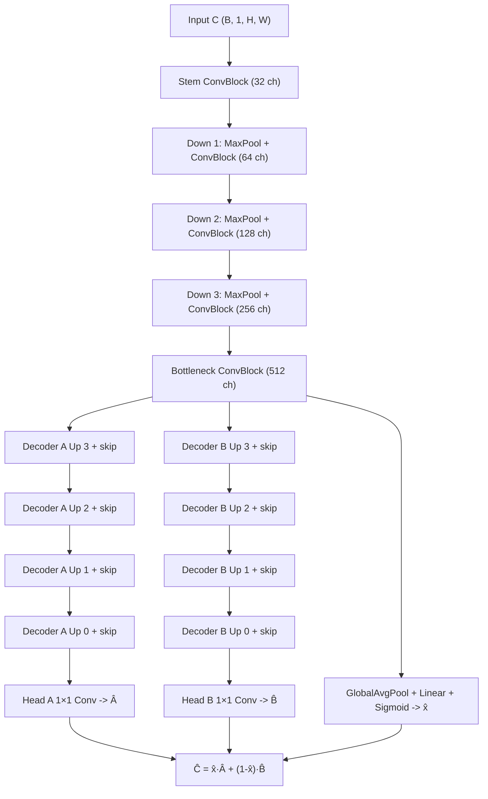

# Dual U-Net (shared encoder, dual decoders)

## Architecture overview

The baseline network is a shared-encoder U-Net that branches into **two decoders** for predicting the pure patterns `(Â, B̂)` from a mixed input `C`. The encoder and bottleneck follow the standard U-Net design, while each decoder mirrors the encoder path with skip connections into a task-specific head. This keeps low-level spatial details aligned while allowing the two outputs to specialize. The design follows U-Net conventions for encoder–decoder segmentation backbones [1] and uses a multi-task shared-encoder, multi-head decoder pattern common in multi-task learning systems [2].

## Input/output tensor shapes

- **Input**: `C` with shape `(B, 1, H, W)` (single-channel mixed pattern).
- **Outputs**: `(Â, B̂)` each with shape `(B, 1, H, W)`, plus `x̂` with shape `(B, 1)` and `ŷ = 1 - x̂`.
- **Type**: the model preserves the input dtype; no implicit casting is performed.

## End-to-end training example (430 × 430 PNGs)

This example uses a single training triplet consisting of one mixed pattern `C` and its two constituents `A` and `B`. Each image is a **single-channel, 16-bit PNG** with size **430 × 430** pixels. The steps below describe what happens to these images during training in the current pipeline.

1. **Load 16-bit images and normalize to float**  
   The dataset loader reads each 16-bit PNG and converts it to floating point in the range `[0, 1]`. At this point, `C`, `A`, and `B` are NumPy arrays of shape `(430, 430)` with `float32` values.

2. **Load ground-truth mixing weights**  
   The synthetic generator writes a `metadata.csv` with `sample_id` and weight `x`. The dataset loader reads `x` for each sample and computes `y = 1 - x`. Both are validated to stay in `[0, 1]` and to satisfy `x + y ≈ 1`.

3. **Optional cropping (disabled by default)**  
   The preprocessing config supports a `crop` option. If enabled and set to `size: [256, 256]`, the loader will take a center crop (or another mode) from all three images so they stay aligned. With this setting, the example would become `256 × 256`.  
   **Default configs** keep cropping **disabled**, so `430 × 430` remains unchanged unless you explicitly turn it on.

4. **Optional augmentations (disabled by default)**  
   If augmentation is enabled, the same random flip/rotation is applied to all three images. Defaults keep augmentation off during baseline training.

5. **Circular mask (enabled by default)**  
   A circular detector mask is applied to each image so that pixels outside the inscribed circle are forced to zero. The pipeline also detects if the image is already masked.

6. **Optional normalization (disabled by default)**  
   If enabled, min–max normalization (optionally “smart” inside-mask normalization) is applied. Defaults keep this **disabled** for synthetic data that is already normalized.

7. **Convert to tensors**  
   Each image becomes a PyTorch tensor of shape `(1, H, W)` (the leading `1` is the channel dimension). A training batch stacks these tensors into shape `(B, 1, H, W)`.

8. **Forward pass through Dual U-Net**  
   The batch tensor for `C` enters the shared encoder, is compressed to a bottleneck, and then splits into two decoders. The network outputs two tensors: `Â` and `B̂`, each with shape `(B, 1, H, W)`.

9. **Weight prediction head**  
   The bottleneck feature map is globally averaged, passed through a linear layer, and squashed with a sigmoid to produce `x̂` in `[0, 1]`. The complementary weight is `ŷ = 1 - x̂`.

10. **Loss calculation**  
    The training loop computes three losses:  
    - `L_ab = L1(Â, A) + L1(B̂, B)`  
    - `L_recon = L1(C, Ĉ)` with `Ĉ = x̂·Â + (1-x̂)·B̂`  
    - `L_x = SmoothL1(x, x̂)`  
    Weighted coefficients in the config control the relative importance.

This sequence gives a concrete view of how a single `430 × 430` input triplet is prepared and propagated through the model during training.

## Default Dual U-Net configuration (block-level view)

The default training configuration uses the following architectural parameters:

- `in_channels: 1`, `out_channels: 1`
- `base_channels: 32`
- `depth: 4` (four encoder levels)
- `up_mode: transpose`
- `use_batchnorm: true`
- `dropout: 0.0`

With these settings, the model uses a shared encoder and two symmetric decoders. Each encoder level doubles the number of feature channels. The bottleneck doubles once more before decoding. The table below shows the **channel flow** (spatial sizes are `H × W` unless cropping is enabled):

| Stage | Operation | Channels (default) |
| --- | --- | --- |
| Input | `C` | 1 |
| Stem | ConvBlock | 32 |
| Down 1 | MaxPool + ConvBlock | 64 |
| Down 2 | MaxPool + ConvBlock | 128 |
| Down 3 | MaxPool + ConvBlock | 256 |
| Bottleneck | ConvBlock | 512 |
| Weight head | GlobalAvgPool + Linear + Sigmoid | 1 (x̂) |
| Up 3 | UpBlock + skip | 256 |
| Up 2 | UpBlock + skip | 128 |
| Up 1 | UpBlock + skip | 64 |
| Up 0 | UpBlock + skip | 32 |
| Head A | 1×1 Conv | 1 |
| Head B | 1×1 Conv | 1 |

**What this means in practice:**  
Each downsampling halves the spatial dimensions (e.g., `430 → 215 → 107 → 53 → 26` if sizes are odd). The upsampling stages reverse this, using skip connections to restore spatial detail. The final outputs `Â` and `B̂` match the original input size.

## Mermaid flowchart (data flow from input to outputs)

## Design rationale

- **Shared encoder**: leverages common feature extraction for the overlapping pattern content, reducing redundant parameters and stabilizing feature reuse [1].
- **Dual decoders**: enable the network to separate pattern-specific representations while still receiving shared low-level spatial cues through skip connections [2].
- **Symmetric heads**: keep A/B predictions balanced and minimize architectural bias.
- **Weight head**: global-average pooling on the bottleneck provides a compact summary for estimating the mixing coefficient `x̂`.

## Loss expectations

Training uses reconstruction losses for both outputs plus a physics-inspired constraint enforcing the additive mixture:

- `L = λab · (L1(Â, A) + L1(B̂, B)) + λrecon · L1(Ĉ, C) + λx · SmoothL1(x̂, x)`
- `Ĉ = x̂·Â + (1 - x̂)·B̂`

The reconstruction term keeps the outputs tied to the mixed input, while the weight term anchors the predicted mixing coefficients.

## References

See [`docs/references.md`](../references.md) for full citations.
